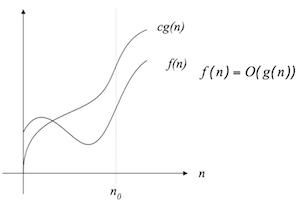

# 演算法複雜度分析

## 演算法的效能
1. 時間複雜度(time complexity)
    1. 最佳狀況(best case)時間複雜度：顯而易見的(trivial)
    2. 最差狀況(worst case)時間複雜度：重要
    3. 平均狀況(average case)時間複雜度
2. 空間複雜度(space complexity)

## 大O記號(Big-O notation)
是漸近上界(Asymptotic Upper Bound)

一種漸近記號(asymptotic notation)表示演算法的時間複雜度(time complexity)

定義：
$$
f(n) = O(g(n))
\iff \exists\,c,n_0 \ni |f(n)| \le c|g(n)| \\
\forall n\ge n_0
$$

例如：
$$
e.g. \
f(n)=3n^2+2 \\
g(n)=n^2 \\
\Rightarrow n_0=2, c=4 \\
\therefore f(n)=O(n^2) \\
$$
