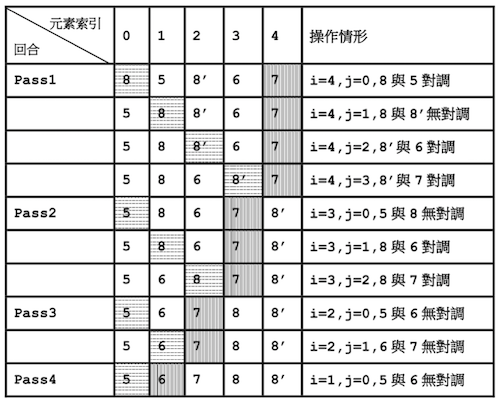
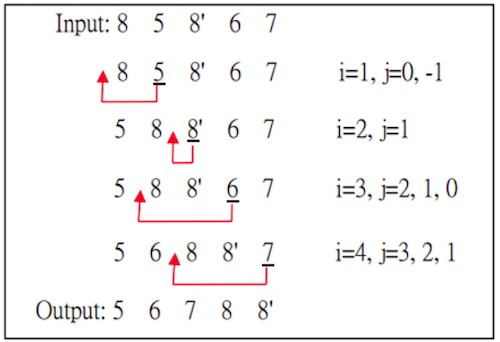
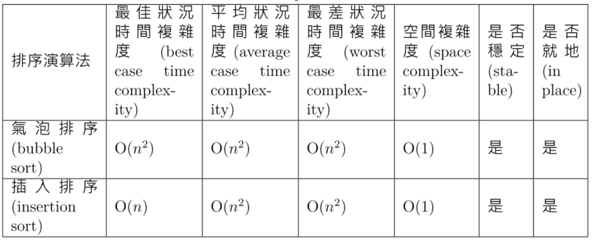

# 演算法複雜度分析

## 演算法的效能
1. 時間複雜度(time complexity)
    1. 最佳狀況(best case)時間複雜度：顯而易見的(trivial)
    2. 最差狀況(worst case)時間複雜度：重要
    3. 平均狀況(average case)時間複雜度
2. 空間複雜度(space complexity)

## 大O記號(Big-O notation)
是漸近上界(Asymptotic Upper Bound)


一種漸近記號(asymptotic notation)表示演算法的時間複雜度(time complexity)

定義：
$$
f(n) = O(g(n))
\iff \exists\,c,n_0 \ni |f(n)| \le c|g(n)| \\
\forall n\ge n_0
$$

例如：
$$
e.g. \
f(n)=3n^2+2 \\
g(n)=n^2 \\
\Rightarrow n_0=2, c=4 \\
\therefore f(n)=O(n^2) \\
$$

## 費伯納西數(Fibonacci series)
定義:  

$$
\begin{align}
& F_1 = F_2 = 1 \\
& F_n = F_{n-1} + F_{n-2} \\
& 1, 1, 2, 3, 5, 8, 13, 21, 34, 55, 89, 144, 233, 377, 610, 987, 1597…
\end{align}
$$

```rb
Algorithm Fibonacci(n)
Input: 正整數n  
Output: 費伯納西數列第n項  
if (n=1 or n=2) then
  return 1
else
  a<-1;b<-1
  for i<-3 to n do
    c<-a+b
    a<-b
    b<-c
  end for
  return c
end if
Time Complexity: O(n)
```

```rb
Algorithm RecursiveFibonacci(n)
Input: 正整數n
Output: 費伯納西數列第n項
if (n=1 or n=2) then
  return 1
else
  a <- RecursiveFibonacci(n-1)
  b <- RecursiveFibonacci(n-2)
  return a+b
end if
Time Complexity: O(2^n)
```

### 遞迴費伯納西數列時間複雜度分析：

假設遞迴費伯納西數列演算法的時間複雜度為`T(n)`(意思是Template)，則我們有:

T(1)=T(2)=1  
T(n)=T(n-1)+T(n-2)  
T(n-1)+T(n-2) ≤ 2T(n-1)  
T(n-1)+T(n-2)+1 ≤ 2T(n-1)+1  
可得T(n) ≤ 2T(n-1)+1 再得 T(n-1) ≤ 2T(n-2)+1 再得   T(n-2) ≤ 2T(n-3)+1  
T(n)=T(n-1)+T(n-2)+1≤2T(n-1)+1 //T(n-1)換掉  
=2(2T(n-2)+1)+1  //T(n-2)換掉  
=4(2T(n-3)+1)+1+2=…  
=2<sup>k</sup>T(n-k)+(1+2+…+2<sup>k-1</sup>)=   2<sup>k</sup>T(n-k)+(2<sup>k</sup>-1)  
令n-k=1，則代入k=n-1，我們可得  
T(n) ≤ 2<sup>n-1</sup>+(2<sup>n-1</sup>-1) ≤ 2<sup>n</sup> for n≥3  
因此，T(n) = O(2<sup>n</sup>)  

## 氣泡排序法

  

氣泡排序演算法能夠讓具有`相同值的元素`維持`原來的相對位置`時，我們稱這種排序演算法為`穩定(stable)排序演算法`。  

氣泡排序演算法不需要額外記憶體空間, 為`就地(in place)` 演算法。  
氣泡排序演算法的`空間複雜度`可以視為是`常數的(也就是O(1))`  

```rb
Algorithm BubbleSort(A,n)
Input: n個整數的array A
Output: A (由小到大排)
for i=n-1 to 1 do
    for j=0 to i-1 do
        if A[j]>A[j+1] then
            swap(A[j], A[j+1])
        end if
    end for
end for
return A
```

### 氣泡排序法時間複雜度分析
一共需要`n-1個回合`才能完成排序工作  
第一個回合需要n-1次比較  
第二個回合需要n-2次比較  
...  
第n-1個回合需要1次比較  
對所有狀況而言,時間複雜度為：
$$\sum_{i=1}^{n-1} i = \frac{n(n-1)}{2} = O(n^2)$$

## 插入排序演算法

  

8 與 8’的相對位置一直保持不變，因此插入排序演算法也是一個`穩定(stable)排序演算法`。  
排序演算法不需要額外記憶體空間,所以也是一個`就地 (in place) 演算法`，其`空間複雜度為 O(1)`。  

```rb
Algorithm InsertionSort(A,n)
Input: n個整數的array A
Output: A (由小到大排)
for i=1 to n-1 do
    j=i-1
    t=A[i] //暫存A[i]
    while (t<A[j] and j>=0) do
        A[j+1] = A[j]
        j=j-1
    end while
    A[j+1]=t
end for
return A
```

### 插入排序演算法的時間複雜度
待補

## 氣泡與插入比較

