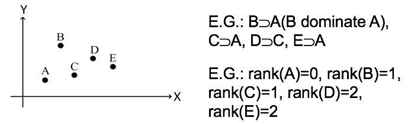
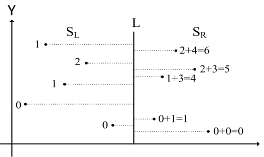

# 分治演算法

## 三個階段
1. 分割階段:如果問題規模很小，就直接解決此問題；否則，將原本的問題分割(divide)成2個或多個子問題(subproblem)。
2. 克服階段:用相同的演算法遞迴地(recirsively)解決或克服(conquer)所有的子問題。
3. 合併階段:合併(merge)所有子問題的解答成為原本問題的解答。

## 合併排序演算法
## 快速排序演算法
## 缺陷棋盤填滿演算法

## 二維求秩演算法(2D rank finding)

### 定義
`支配(dominate)`  
`秩(rank)`  


### 題目
給定一個由n個二維平面點所構成的集合S，求出S中所有點的秩。
可以用窮舉(exhaustive)演算法，比較所有的可能成對點，時間複雜度為O(n^2)。



### 演算法
```
Algorithm 二維求秩演算法
Input: n個二維平面點所構成的集合S，n>=1
Output: 集合S中所有點的秩(rank)
步驟1: 若n=1，則回傳S中唯一一個點的秩為0並結束。
步驟2: 找出所有點的X軸中位數(median)畫出垂直於X軸的直線L，將S中的點分為二個集合S_L與S_R。
步驟3: 遞迴地使用二維求秩演算法分別求出S_L與S_R中所有點的秩。
步驟4: 根據Y軸值排序所有在S(S=S_L or S_R)中的點，依序由小而大掃描所有點，求出每一個在S_R的點i排在多少在S_L的點的後面(記為update_i)，並將點i的秩加上update_i，最後回傳S中所有點的秩。
```

### 時間複雜度分析

步驟時間複雜度:
$$
步驟2: c_1 nlogn (排序) \\
步驟4: c_2 nlogn (排序) \\
$$

總時間複雜度:
$$
\begin{align}
T(n) & = 2T(n/2) + c_1 nlogn + c_2 nlogn \\
& = 2T(n/2) + cnlogn \\
& = 2( 2T(n/4)+c(n/2) log (n/2) )+ cn log n \\
& = 4T(n/4) + cn log (n/2) + cn log n \\
& = nT(1) + cn(log n + log (n/2)+ log (n/4) +…+ log 2) \\
& \le nT(1) + cn (log n (log n+ log 2))/2 (其中T(1)=1) \\
& = O(n log^2n)
\end{align}
$$

$$
PS: nlog^2n = n(logn)^2
$$

## 二維極大點演算法
## 最近二維點對演算法
