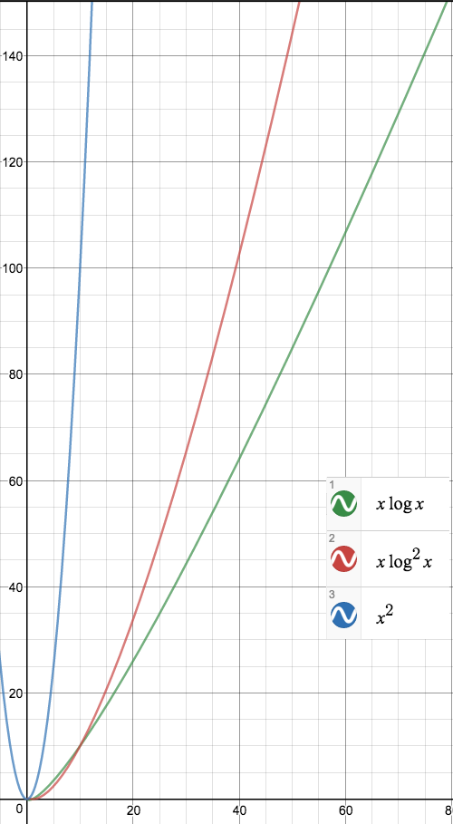

# Problem Set 3:
## (A) 舉出一個方法讓快速排序(quick sort)演算法避免產生最壞狀況。

1. 亂數挑
2. 挑陣列的第一個, 中間的, 及最後一個元素, 用這三個之中的中位數 (median) 來當做 pivot。  
3. Java 的 Quicksort 是把陣列切成前中後三段，拿這三段中央的數字，三個數字的中位數當作 pivot。

## (B) 寫一個分治演算法來解決一個給定數值集合的求秩(rank finding)問題，並進行複雜度分析。

跳
好像要用到merge sort

## (C) 寫一個分治演算法來找出一群在X軸上的點中的最近點對(closest pair of points on X-axis)，並進行複雜度分析。

跳

## (D) 畫出nlogn、n(logn)^2及n^2圖形(n=2, 4, 8, ..., 128)並比較之。

## (E) 說明如何使用預先排序(pre-sorting)於分治最近二維點對 (closest pair of 2D points)演算法。

跳
